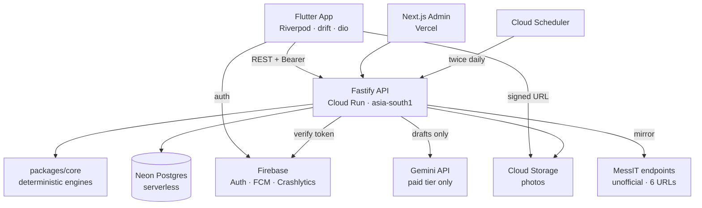
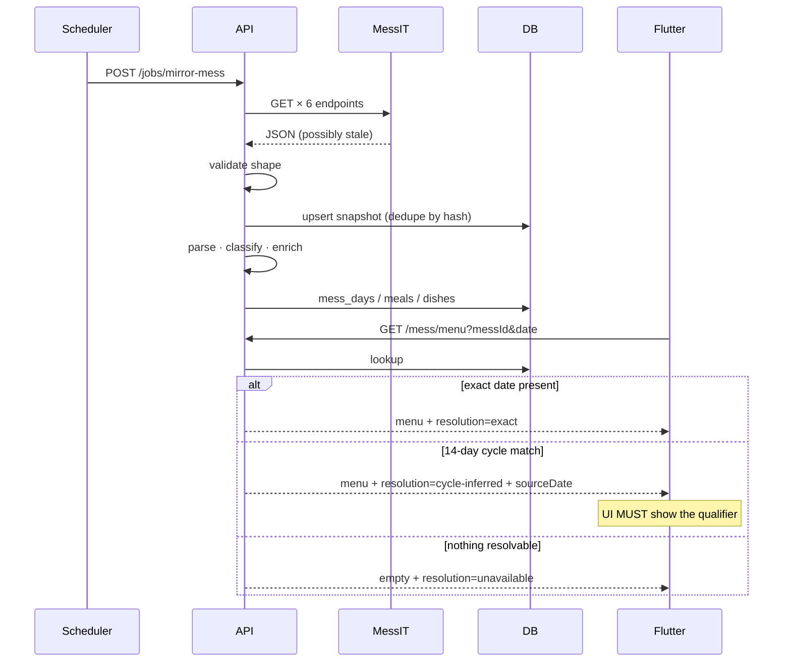
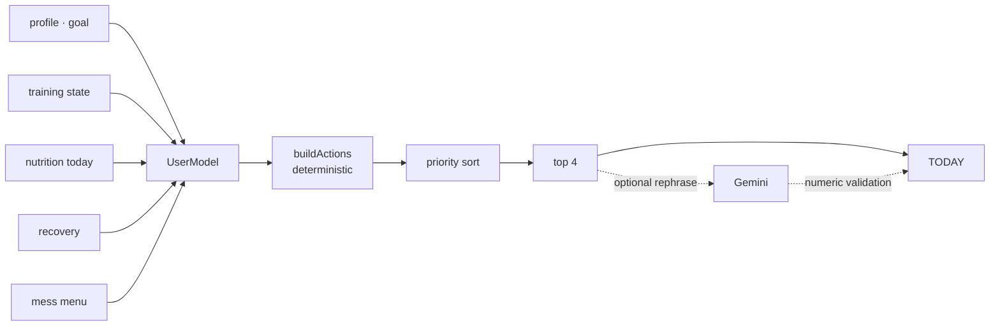

# FitOS — Master Product & Technical Specification

**Version** 1.0 · **Date** 2026-09-07 · **Status** Authoritative blueprint for implementation
**Audience** The VS Code coding agent, and any senior engineer joining the project.

### Tag legend

| Tag | Meaning |
|---|---|
| `RESEARCH` | Verified from a source during specification. Date of verification given. |
| `DECISION` | An architectural choice made here. Do not change without recording a new decision. |
| `ASSUMPTION` | Reasoned but unverified. Safe to build on; revisit if it breaks. |
| `UNVERIFIED` | Not confirmed. Must be checked before relying on it. |
| `OPEN QUESTION` | Needs a human decision before the relevant phase begins. |

---

## 1. Executive Summary

FitOS is a personal fitness operating system for Indian gym-goers, wedged initially at VIT Vellore students living in hostels. It answers one question every day: **what should I do next?** — across training, nutrition, recovery and progress.

Three things make it defensible:

1. **A deterministic decision engine.** Every number — calorie targets, TDEE, weight trend, load progression, deload timing, plate selection, action ranking — is computed by tested code, not a language model. This is the core architectural rule of the project.
2. **Real mess-food nutrition.** The app consumes the live MessIT endpoints for all six VIT Vellore messes, parses a hostile comma-joined format, and answers "what should I eat right now" from tonight's actual menu. No competitor does this.
3. **Honest uncertainty.** Mess nutrition is estimated, so it renders as a range with a confidence level and never as a fake-precise number. The type system enforces this.

**Working code already exists** for the mess subsystem and the deterministic engines: `packages/core`, 82 passing tests, strict TypeScript, validated against real captured endpoint responses. That package is preserved as-is and becomes the backend's domain layer. See §5.

**Stack (`DECISION`):** Flutter + Dart → Node.js/TypeScript REST API on Google Cloud Run → **Neon serverless Postgres** → Firebase Auth / FCM / Crashlytics. Gemini on a **paid** tier for language tasks only.

> **The one change from your stated preference:** you asked for Cloud SQL under Cloud Run. Cloud SQL has no free tier and is the single largest avoidable cost in this design (~$10–30/month from day one, forever). Neon's free plan gives serverless Postgres with scale-to-zero, no credit card, and no expiry. Everything else in your preferred architecture survives intact. Full reasoning in §8.4.

---

## 2. Product Vision

> A personal fitness operating system that continuously understands the user's body, goals, training, nutrition, recovery and environment, and tells them what to do next.

The product is not a tracker. A tracker records what happened and leaves interpretation to the user. FitOS maintains a continuously updated user model and converts it into a small, ranked set of actions.

**Product principles, in priority order:**

1. **Decide, don't display.** If the app can compute the answer, it must not hand the user a chart and make them work it out.
2. **Every recommendation carries its reason.** The user can always see why. Reasons are generated by the engine, not invented by a model.
3. **Honest about what it knows.** Logged, calculated and estimated data are visually distinct. Estimates are ranges.
4. **Fast logging beats rich logging.** One tap per set. If logging is slow, nothing else matters because the user churns.
5. **Never shame.** A missed day is information, not a moral failure.

---

## 3. Target Users

| | Persona | Core need | Why they churn elsewhere |
|---|---|---|---|
| **A** | Beginner, muscle gain | Prescriptive structure, confidence | Overwhelmed; no idea if they're doing it right |
| **B** | Intermediate, fat loss | Targets that adapt when the scale stalls | Static calorie targets stop working |
| **C** | **VIT hostel student** (wedge) | Hitting protein on mess food, on a budget | No app understands a thali |
| **D** | Experienced lifter | Fast logging + real analytics | Loggers don't coach; coaches don't log well |

Persona C is the go-to-market wedge: geographically concentrated, underserved, and reachable through campus channels. Personas A/B/D are the expansion path and must not be designed out.

---

## 4. Core Differentiation

| Differentiator | Why competitors don't have it |
|---|---|
| Mess-aware "what should I eat now" | Requires Indian institutional-food data nobody has modelled |
| Unified train + eat + recover decision layer | Hevy logs; Fitbod prescribes; MacroFactor does nutrition — none combine |
| Explainable determinism | Fitbod's progression is opaque; most AI apps can't explain because an LLM decided |
| Range-based honesty | Every AI calorie app reports fake point estimates |
| Athletic-editorial design on paper ground | Category is uniformly dark telemetry dashboards |

**Positioning statement:** For gym-goers who eat what the mess serves, FitOS is the training and nutrition app that tells you what to do next — because it understands both your programme and your plate.

---

## 5. Existing Code — Disposition

`packages/core` exists and works. **Do not rewrite it.** Its disposition is fixed:

| Component | File | Status | Action |
|---|---|---|---|
| Mess domain types | `mess/types.ts` | **Preserve** | Becomes shared contract source |
| Menu string parser | `mess/parse.ts` | **Preserve** | Hardened against 7 real defects; do not "simplify" |
| Diet/role classifier | `mess/classify.ts` | **Preserve + extend** | Extend keyword lists only; keep fail-safe semantics |
| Nutrition estimate table | `mess/nutrition.ts` | **Extend** | ~55 dishes now; grow to ~300 and add IFCT mapping (Phase 9) |
| Plate recommender | `mess/recommend.ts` | **Preserve + extend** | Add carb/fat/budget/variety terms (Phase 10) |
| VIT provider + config | `mess/providers/vit/` | **Preserve** | Add server-side mirroring (Phase 9) |
| Targets (Mifflin-St Jeor) | `nutrition/targets.ts` | **Preserve** | Add recomposition + maintenance goals (Phase 2) |
| Trend + adaptive TDEE | `nutrition/trend.ts` | **Preserve** | Complete |
| Progression engine | `training/progression.ts` | **Preserve** | Complete for MVP |
| TODAY decision engine | `recommend/engine.ts` | **Preserve + extend** | `UserModel` gains recovery fields (Phase 13) |
| Test fixtures | `test/fixtures/*.json` | **Preserve** | Real captured responses. Never regenerate synthetically. |
| **Volume engine** | — | **MISSING** | Build in Phase 6 |
| **Workout generator** | — | **MISSING** | Build in Phase 4 |

`DECISION` — `packages/core` stays **framework-free TypeScript and runs only on the backend**. It is never ported to Dart. Flutter receives computed results over the API. This is the single most important rule for avoiding duplicated business logic.

---

## 6. UX/UI Principles — Athletic Editorial

### 6.1 Prohibited

Card soup · uniform rounded cards · glassmorphism · decorative gradients · AI illustrations · "Good morning 👋" · circular progress rings as default · heavy shadows · every feature inside a card · motivational quotes · emoji in system copy.

### 6.2 Design tokens (`DECISION`)

```
--paper       #EDEBE4   canvas (bone, not cream)
--paper-2     #E4E1D8   recessed surfaces
--ink         #17171A   primary type, primary buttons
--ink-60      #5E5D58   secondary type
--ink-35      #95938C   tertiary / disabled
--rule        #C9C6BB   hairlines
--pine        #1E6B47   on track / complete / logged
--amber       #A8641B   attention / approaching limit / estimated
--oxide       #9E2B21   fatigue / missed / destructive
radius        2px  (4px maximum, never more)
```

Colour carries meaning only. Primary actions are **solid ink blocks**, never coloured, so colour never competes with semantics. There are exactly three semantic colours; adding a fourth requires a recorded decision.

`DECISION` — light foundation. Every major competitor (WHOOP, Oura, Strava, Hevy) is dark. Paper reads as a training log rather than a telemetry dashboard, and it is the differentiated choice.

### 6.3 Type

| Role | Face | Usage |
|---|---|---|
| Metrics, session names | **Anton** | Large numbers only. 26–88px. |
| Everything else | **Archivo** | 11–19px, weights 400/600/700 |

Hierarchy comes from type scale and whitespace, not from boxes. Numbers are the hero.

### 6.4 Spacing & grid

8px base. Screen padding 18px. Section separation by 1px `--rule` hairline + 14px, not by card margins. Single-column, left-aligned. Large metrics may break the text column.

### 6.5 Data provenance is visual

| Basis | Treatment |
|---|---|
| `logged` | Ink, full weight. User entered it. |
| `calculated` | Ink, with an available "why" affordance. |
| `estimated` | Range notation (`280–350 kcal`) + confidence bar in `--amber`. Never a bare number. |

### 6.6 States

- **Empty:** an instruction, never a mood. *"Your first session becomes the baseline. [Start first workout]"*
- **Loading:** skeletons matching final layout. No spinners over 400ms of content.
- **Error:** what happened, what to do. *"Tonight's menu hasn't been published. Showing the menu from the same day in the last cycle."*
- **Offline:** persistent but quiet banner; logging continues to work.

### 6.7 Motion

Motion answers user actions: set logged, action completed, screen transition. One orchestrated moment maximum per screen. Respect `MediaQuery.disableAnimations`. No entrance animations on scroll.

### 6.8 Accessibility

WCAG AA contrast (verified for all token pairs on `--paper`). Minimum 44×44 tap targets. Full screen-reader labels on every metric — a number without a label is meaningless aurally. Support text scaling to 200% without clipping; large metrics cap their scale factor and never truncate.

---

## 7. Flutter Architecture

### 7.1 Stack (`DECISION`)

| Concern | Package | Why | Alternative |
|---|---|---|---|
| Framework | Flutter (stable) | Single codebase, 60fps custom UI, mature charts | React Native |
| State | **Riverpod 3.x** + codegen | `RESEARCH` (2026-09): consolidated community default; compile-safe, no BuildContext dependency, less boilerplate than Bloc | Bloc/Cubit |
| Routing | **go_router** | Declarative, deep links, guard support | auto_route |
| HTTP | **dio** + interceptors | Retry, auth refresh, logging | http |
| API client | **openapi-generator** (Dart) | Generated from backend OpenAPI — contracts can't drift | Hand-written |
| Local DB | **drift** (SQLite) | Typed SQL, migrations, reactive queries — needed for offline workouts | Isar, Hive |
| Key-value | **shared_preferences** | Trivial flags only | — |
| Secure store | **flutter_secure_storage** | Token storage (Keychain / Keystore) | — |
| Models | **freezed** + **json_serializable** | Immutable unions; models `MenuResolution` correctly | — |
| DI | Riverpod providers | Already present; a second DI container is redundant | get_it |
| Charts | **fl_chart** | Customisable enough for the design language | syncfusion (licence) |
| Camera | **camera** + **image_picker** | Photo logging (V2) | — |
| Notifications | **firebase_messaging** + **flutter_local_notifications** | Push + local rest timers | — |
| Health | **health** package | Health Connect (Android) / HealthKit (iOS) | Platform channels |
| Analytics | **firebase_analytics** | Free, adequate | PostHog |
| Crash | **firebase_crashlytics** | Free | Sentry |

`ASSUMPTION` — pin exact versions at Phase 0 and record them in `apps/mobile/pubspec.lock`. Do not float versions.

### 7.2 Structure — feature-first Clean Architecture

```
apps/mobile/lib/
  main.dart
  app.dart                        # MaterialApp.router, theme, error boundary
  core/
    config/        env.dart, flavors.dart
    theme/         tokens.dart, typography.dart, app_theme.dart
    routing/       router.dart, routes.dart, guards.dart
    network/       dio_client.dart, auth_interceptor.dart, retry_interceptor.dart
    storage/       drift/ (database.dart, tables/, daos/), secure_storage.dart
    sync/          sync_queue.dart, sync_worker.dart, conflict.dart
    errors/        failure.dart, error_mapper.dart
    utils/
  features/
    <feature>/
      data/        dtos/, <f>_remote_ds.dart, <f>_local_ds.dart, <f>_repository_impl.dart
      domain/      entities/, repositories/ (abstract), (NO business rules — see below)
      presentation/ screens/, widgets/, controllers/ (Riverpod notifiers)
  shared/
    widgets/       metric_display.dart, estimate_range.dart, ledger_row.dart,
                   hairline_section.dart, ink_button.dart, confidence_bar.dart
    formatters/
```

Features: `auth`, `onboarding`, `today`, `training`, `nutrition`, `mess`, `progress`, `recovery`, `profile`, `settings`.

### 7.3 The domain-layer rule

`DECISION` — a Flutter `domain/` layer contains **entities and repository interfaces only**. It contains **zero fitness business rules**. No calorie maths, no progression logic, no ranking. Those live in `packages/core` on the backend.

Permitted client-side computation, exhaustively:
- Formatting and unit display (kg/lb, date formats)
- Summing set volume *for the in-progress session display only* (recomputed authoritatively server-side)
- Sorting/filtering already-fetched lists
- Form validation mirroring server validation (server remains authoritative)

If the agent is about to write a calorie or progression formula in Dart, **that is a specification violation.** Add the endpoint instead.

### 7.4 Widget rules

- No business logic in `build()`.
- Screens read one controller provider; widgets take plain data.
- Any widget over ~150 lines gets decomposed.
- Every widget file has an accompanying golden or widget test for non-trivial layout.

---

## 8. Backend Architecture

### 8.1 Stack (`DECISION`)

| Concern | Technology | Why | Alternative | Cost |
|---|---|---|---|---|
| Runtime | Node.js 22 LTS | Reuses `packages/core` unchanged | Go, Python | — |
| Language | TypeScript strict | Existing code; shared types with admin | — | — |
| Framework | **Fastify** | Fast, first-class JSON-schema validation, native OpenAPI | Express, NestJS | — |
| Validation | **Zod** + `fastify-type-provider-zod` | One schema drives runtime validation, TS types, and OpenAPI | class-validator | — |
| ORM | **Drizzle ORM** | Thin, SQL-first, excellent TS inference, tiny cold start | Prisma | — |
| Migrations | **drizzle-kit** | SQL files in git, reviewable | — | — |
| Auth verify | **firebase-admin** | Verifies Firebase ID tokens | Custom JWT | Free |
| Cache | In-process LRU → Redis later | Redis is not needed at MVP scale | — | ₹0 |
| Logging | **pino** + Cloud Logging | Structured JSON; GCP parses natively | winston | Free tier |
| Docs | **@fastify/swagger** | OpenAPI 3.1 generated from Zod | — | — |
| Jobs | **Cloud Scheduler** → HTTP | No worker process to keep warm | Cloud Tasks | Free tier |
| Tests | **vitest** | Already used by `packages/core` | jest | — |

### 8.2 Why not NestJS

NestJS brings DI, decorators and module ceremony that this project does not need — the domain logic is already isolated in `packages/core`, and Fastify + Zod gives typed validation and OpenAPI with far less boilerplate and faster cold starts, which matter on Cloud Run.

### 8.3 Module layout

```
apps/api/src/
  server.ts                    # Fastify bootstrap, plugin registration
  plugins/                     # auth, db, error-handler, rate-limit, swagger
  modules/
    <module>/
      routes.ts                # HTTP + Zod schemas only
      service.ts               # orchestration; calls packages/core
      repository.ts            # Drizzle queries only
      schemas.ts               # Zod request/response
      <module>.test.ts
  db/  schema/ (Drizzle tables), migrations/, seeds/
  jobs/ mess-mirror.ts, daily-rollup.ts, adjustment-sweep.ts
  lib/ gemini.ts, errors.ts, logger.ts
```

Modules: `auth`, `user`, `training`, `exercise`, `workout`, `nutrition`, `food`, `mess`, `recommendation`, `progress`, `recovery`, `notification`, `admin`.

**Layer discipline:** routes never touch the database; services never build SQL; repositories never contain fitness rules. Fitness rules exist only in `packages/core`.

### 8.4 Hosting decision — and the change from your preference

`RESEARCH` (verified 2026-09-07):

| Service | Free allowance | Expiry | Notes |
|---|---|---|---|
| Cloud Run | 2M requests/month, generous vCPU-s and GiB-s | **Never** | Per *billing account*, not per project. Billing account must be attached (rule tightened 2026-02-03). |
| Firebase Auth | Generous free tier | Never | Email + Google sign-in |
| FCM | Unlimited | Never | |
| Crashlytics / Analytics | Free | Never | |
| Cloud Storage | 5 GB standard | Never | |
| **Cloud SQL** | **None** | — | **This is the problem.** |
| GCP trial credit | $300 | 90 days | Trial only, not a student programme |
| **Neon Postgres Free** | 0.5 GB/project, 100 CU-hours/month/project, up to 100 projects, scale-to-zero after 5 min, **no credit card** | **Never** | Compute resumes in a few hundred ms |
| Supabase Free | 500 MB, 50k MAU, 2 projects | Never | **Pauses after 7 days inactivity** — disqualifying for a live app |
| Azure for Students | $100, renewable while enrolled, no card | Annual | The most straightforward student credit available |

`RESEARCH` — there is **no simple Google Cloud student credit programme** comparable to Azure for Students. The $300 is a 90-day trial.

`DECISION` — **Cloud Run + Neon, not Cloud Run + Cloud SQL.**

Cloud SQL's smallest instance runs continuously and costs roughly $10–30/month from the first day and forever. That is the single largest avoidable line item in the whole design, and it buys nothing an MVP needs. Neon is standard Postgres, scales to zero, costs ₹0, requires no card, and its free plan does not expire. Migration to Cloud SQL later is a `pg_dump` and a connection-string change, because we use plain Postgres through Drizzle with no proprietary features.

Everything else in your preferred stack is kept: Cloud Run, Firebase Auth, FCM, Crashlytics, Analytics, Cloud Storage, Cloud Scheduler, Gemini.

**Known trade-offs, accepted:**
- Neon free scale-to-zero cannot be disabled → first query after idle adds a few hundred ms. Combined with Cloud Run cold start, worst-case first request may reach ~1.5–2s. Mitigation: Cloud Scheduler pings `/health` every 5 minutes during Indian waking hours, which also keeps Neon warm. `ASSUMPTION` — verify this stays within free CU-hours; 100 CU-hours/month is roughly 3 hours/day of active compute.
- 0.5 GB storage. `ASSUMPTION` — ample for low thousands of users; body photos go to Cloud Storage, never the database.
- `OPEN QUESTION` — Cloud Run region. `asia-south1` (Mumbai) minimises latency for Indian users. `UNVERIFIED` whether the always-free tier applies identically outside Tier-1 US regions. **Verify in Phase 0 before deploying.** Fallback: `us-central1` accepting ~200ms extra latency.

---

## 9. Database Architecture

### 9.1 Conventions

- Postgres 16+. All ids `uuid` (`gen_random_uuid()`).
- `created_at`/`updated_at` `timestamptz NOT NULL DEFAULT now()`.
- Soft delete (`deleted_at timestamptz`) **only** on user-authored content: `workout_sessions`, `food_logs`, `body_metrics`, `programs`. Everything else hard-deletes.
- Money/mass/energy stored as `numeric`, never float. Weight in **kg**, energy in **kcal**; unit conversion is presentation-only.
- Every user-scoped table has `user_id uuid NOT NULL REFERENCES users(id) ON DELETE CASCADE` and an index on `(user_id, <primary sort column>)`.
- All timestamps UTC. `users.timezone` drives day boundaries — **"today" is computed in the user's timezone, never the server's.**

### 9.2 Schema

**Identity & profile**

| Table | Key columns | Notes |
|---|---|---|
| `users` | `id`, `firebase_uid` UNIQUE, `email`, `timezone`, `locale`, `created_at`, `deleted_at` | No password. Firebase owns credentials. |
| `user_profiles` | `user_id` PK/FK, `sex`, `birth_date`, `height_cm`, `experience_level`, `training_days_per_week`, `activity_level`, `preferred_session_minutes`, `onboarding_stage` | 1:1 |
| `user_goals` | `id`, `user_id`, `goal_type`, `target_weight_kg`, `started_at`, `ended_at` | History; active row has `ended_at IS NULL`. Partial unique index on active. |
| `diet_preferences` | `user_id` PK/FK, `diet_type`, `excluded_dish_ids jsonb`, `budget_tier` | |
| `user_allergies` | `id`, `user_id`, `allergen`, `severity` | **Safety-critical.** Hard filter, never a scoring penalty. |
| `user_limitations` | `id`, `user_id`, `body_part`, `note`, `active` | Drives exercise substitution |
| `user_preferences` | `user_id` PK/FK, `units`, `notification_settings jsonb`, `feature_flags jsonb` | |
| `consent_records` | `id`, `user_id`, `consent_type`, `granted`, `policy_version`, `granted_at`, `ip_hash` | DPDP evidence. Append-only. |

**Body & progress**

| Table | Key columns | Notes |
|---|---|---|
| `body_metrics` | `id`, `user_id`, `measured_on date`, `weight_kg`, `source` | UNIQUE `(user_id, measured_on)`. Trend is **derived, never stored**. |
| `body_measurements` | `id`, `user_id`, `measured_on`, `site`, `value_cm` | waist/chest/arm/thigh/hip |
| `progress_photos` | `id`, `user_id`, `taken_on`, `storage_path`, `pose` | Path only. Bytes in Cloud Storage. |

**Training**

| Table | Key columns | Notes |
|---|---|---|
| `exercises` | `id`, `slug` UNIQUE, `name`, `movement_pattern`, `equipment[]`, `difficulty`, `is_unilateral`, `default_increment_kg`, `instructions`, `video_url` | Global, not user-scoped |
| `exercise_muscles` | `exercise_id`, `muscle_group`, `role` (`primary`/`secondary`), `contribution numeric` | Secondary counts as 0.5 sets toward volume |
| `exercise_alternatives` | `exercise_id`, `alternative_id`, `reason` (`equipment`/`injury`/`preference`) | |
| `exercise_contraindications` | `exercise_id`, `body_part` | Joins `user_limitations` |
| `programs` | `id`, `user_id`, `name`, `split_type`, `days_per_week`, `source` (`generated`/`custom`), `mesocycle_week`, `active`, `deleted_at` | Partial unique index: one active program per user |
| `program_days` | `id`, `program_id`, `day_of_week`, `session_name`, `focus[]`, `is_rest` | |
| `planned_exercises` | `id`, `program_day_id`, `exercise_id`, `order_index`, `set_count`, `rep_min`, `rep_max`, `target_rir`, `increment_kg` | |
| `workout_sessions` | `id`, `user_id`, `program_day_id` NULL, `started_at`, `completed_at`, `duration_seconds`, `notes`, `client_session_id` UNIQUE, `deleted_at` | `client_session_id` provides offline idempotency |
| `session_exercises` | `id`, `session_id`, `exercise_id`, `order_index` | |
| `set_logs` | `id`, `session_exercise_id`, `set_index`, `set_type` (`warmup`/`working`/`drop`/`backoff`), `weight_kg`, `reps`, `rir`, `rpe`, `is_pr`, `logged_at`, `client_set_id` UNIQUE | Only `working` sets count toward volume and progression |
| `muscle_volume_weekly` | `user_id`, `iso_week`, `muscle_group`, `hard_sets numeric`, `tonnage_kg` | **Derived cache**, rebuildable from `set_logs` |
| `exercise_prs` | `id`, `user_id`, `exercise_id`, `pr_type` (`1rm_est`/`weight`/`reps`/`volume`), `value`, `achieved_at`, `set_log_id` | |

**Nutrition**

| Table | Key columns | Notes |
|---|---|---|
| `foods` | `id`, `name`, `brand`, `barcode`, `source` (`ifct`/`indb`/`usda`/`user`/`estimated`), `is_verified`, `owner_user_id` NULL | Trigram index on `name` for search |
| `food_nutrition` | `food_id`, `basis` (`per_100g`/`per_serving`), `serving_label`, `serving_grams`, `kcal_low`, `kcal_high`, `protein_low`, `protein_high`, `carb_low`, `carb_high`, `fat_low`, `fat_high`, `fiber_low`, `fiber_high`, `confidence` | **Ranges are mandatory.** A verified food simply has `low == high`. |
| `food_aliases` | `food_id`, `alias` | Handles `Dhal`/`Dal`, `Panneer`/`Paneer` |
| `food_logs` | `id`, `user_id`, `logged_at`, `meal_slot`, `entry_method`, `client_log_id` UNIQUE, `deleted_at` | |
| `food_log_items` | `id`, `food_log_id`, `food_id` NULL, `mess_dish_id` NULL, `servings numeric`, `kcal_low..fat_high`, `confidence` | Macros **snapshotted at log time** so history doesn't shift when the table is corrected |
| `daily_nutrition` | `user_id`, `date`, `kcal`, `protein_g`, `carb_g`, `fat_g`, `fiber_g`, `kcal_target`, `protein_target_g` | Derived cache, rebuildable |
| `nutrition_targets` | `id`, `user_id`, `effective_from date`, `kcal`, `protein_g`, `carb_g`, `fat_g`, `fiber_g`, `tdee_estimate`, `reason` | History; never mutate a past row |
| `saved_meals` | `id`, `user_id`, `name`, `items jsonb` | One-tap re-log |

**Mess**

| Table | Key columns | Notes |
|---|---|---|
| `mess_providers` | `id`, `slug` (`vit-vellore`), `display_name`, `status`, `last_sync_at` | |
| `messes` | `id`, `provider_id`, `hostel_id`, `mess_id`, `hostel_label`, `mess_label`, `serves_non_veg`, `source_url` | The six rows |
| `mess_menu_snapshots` | `id`, `mess_id`, `fetched_at`, `raw_payload jsonb`, `payload_hash` | **Server-side mirror.** Survives upstream outage; gives history the endpoints don't keep. |
| `mess_days` | `id`, `mess_id`, `menu_date`, `resolution` (`exact`/`cycle_inferred`/`unavailable`), `source_date`, `cycle_length_days`, `snapshot_id` | |
| `mess_meals` | `id`, `mess_day_id`, `slot`, `raw_menu text` | Verbatim upstream string retained |
| `mess_dishes` | `id`, `mess_meal_id`, `dish_slug`, `name`, `raw`, `label`, `diet_class`, `dish_role`, `alternatives[]`, `is_ambient` | |
| `mess_dish_nutrition` | `dish_slug` PK, `food_id` NULL, `serving_label`, `serving_grams`, `kcal_low..fat_high`, `confidence`, `source` | **Keyed by slug, not dish id** — one correction fixes every future occurrence |
| `mess_dish_corrections` | `id`, `dish_slug`, `user_id` NULL, `field`, `value`, `status`, `reviewed_by` | Community + admin corrections |

**Recommendations, recovery, ops**

| Table | Key columns | Notes |
|---|---|---|
| `recommendations` | `id`, `user_id`, `generated_for date`, `kind`, `headline`, `detail`, `target`, `priority`, `basis`, `payload jsonb` | |
| `recommendation_events` | `id`, `recommendation_id`, `event` (`shown`/`opened`/`accepted`/`dismissed`/`completed`), `occurred_at` | Measures whether the engine actually helps |
| `recovery_logs` | `id`, `user_id`, `logged_on date`, `sleep_hours`, `sleep_quality`, `soreness`, `energy`, `stress`, `source` | UNIQUE `(user_id, logged_on)` |
| `health_samples` | `id`, `user_id`, `sample_type`, `value`, `unit`, `recorded_at`, `source` | Health Connect / HealthKit (V2) |
| `notifications` | `id`, `user_id`, `kind`, `scheduled_for`, `sent_at`, `opened_at` | |
| `audit_logs` | `id`, `actor_user_id`, `action`, `entity`, `entity_id`, `metadata jsonb`, `occurred_at` | Admin actions + data export/delete |

### 9.3 Critical indexes

```sql
CREATE INDEX ON set_logs (session_exercise_id, set_index);
CREATE INDEX ON workout_sessions (user_id, started_at DESC) WHERE deleted_at IS NULL;
CREATE INDEX ON food_logs (user_id, logged_at DESC) WHERE deleted_at IS NULL;
CREATE UNIQUE INDEX ON body_metrics (user_id, measured_on);
CREATE INDEX ON mess_days (mess_id, menu_date);
CREATE INDEX food_name_trgm ON foods USING gin (name gin_trgm_ops);
CREATE UNIQUE INDEX one_active_program ON programs (user_id) WHERE active AND deleted_at IS NULL;
CREATE UNIQUE INDEX one_active_goal ON user_goals (user_id) WHERE ended_at IS NULL;
```

### 9.4 Derived vs stored

`DECISION` — these are **caches** and must be rebuildable by a script from source rows: `muscle_volume_weekly`, `daily_nutrition`, `exercise_prs`, `mess_days`/`mess_meals`/`mess_dishes` (from `mess_menu_snapshots`). Trend weight is **never stored** — it is computed from `body_metrics` on read, so changing the smoothing constant doesn't require a backfill.

Ship `scripts/rebuild-derived.ts` in Phase 12 and run it in CI against seed data.

---

## 10. API Architecture

`DECISION` — **REST + OpenAPI 3.1**, generated from Zod. Not GraphQL (no client-shaped-query need, worse caching, more machinery). Not tRPC (the client is Dart; tRPC's benefit is TS end-to-end, which doesn't apply).

Base: `https://api.fitos.app/v1`. Auth: `Authorization: Bearer <Firebase ID token>` on everything except `/health` and `/v1/meta/*`.

**Standard error envelope:**
```json
{ "error": { "code": "VALIDATION_FAILED", "message": "Human readable.",
             "details": [{ "path": "weightKg", "issue": "must be > 0" }],
             "requestId": "01J..." } }
```
Codes: `UNAUTHENTICATED` 401 · `FORBIDDEN` 403 · `NOT_FOUND` 404 · `VALIDATION_FAILED` 422 · `CONFLICT` 409 · `RATE_LIMITED` 429 · `UPSTREAM_UNAVAILABLE` 503 · `INTERNAL` 500.

### 10.1 Endpoints

| Method | Path | Purpose | Notes |
|---|---|---|---|
| POST | `/auth/session` | Exchange Firebase token → create/fetch user | Idempotent |
| DELETE | `/auth/session` | Sign out (revoke refresh) | |
| GET/PATCH | `/user/profile` | Profile read/update | Partial update |
| GET/PUT | `/user/goal` | Active goal; PUT closes old, opens new | Recomputes targets |
| GET/PUT | `/user/diet-preferences` | Diet, allergies, exclusions | |
| GET/PATCH | `/user/preferences` | Units, notifications | |
| POST | `/user/export` | Request full data export | Async → email link |
| DELETE | `/user` | Delete account + all data | Requires re-auth |
| GET | `/onboarding/state` | Next question set | Drives progressive profiling |
| POST | `/onboarding/answer` | Submit a step | Returns updated state |
| POST | `/onboarding/complete` | Generate profile + program + targets | Returns first plan |
| GET | `/exercises` | Search/filter | `?q&equipment&muscle&pattern` |
| GET | `/exercises/{id}` | Detail + alternatives | |
| GET | `/exercises/{id}/history` | User's history for this lift | |
| GET | `/training/program` | Active program + week | |
| POST | `/training/program/generate` | Generate from goal/constraints | |
| PUT | `/training/program` | Replace with custom | |
| PATCH | `/training/program/days/{id}` | Edit a day | |
| GET | `/training/today` | Today's prescription **incl. per-exercise target loads** | **Cached offline** |
| POST | `/training/sessions` | Start session (`clientSessionId`) | Idempotent |
| POST | `/training/sessions/{id}/sets` | Log set (`clientSetId`) | Idempotent; batch accepted |
| PATCH | `/training/sessions/{id}/sets/{setId}` | Correct a set | |
| POST | `/training/sessions/{id}/complete` | Finish; recompute volume, PRs, progression | Returns PRs earned |
| GET | `/training/sessions` | History | Paginated |
| GET | `/training/volume` | Weekly per-muscle vs landmarks | |
| GET | `/nutrition/today` | Targets, consumed, remaining, logs | |
| GET | `/nutrition/day/{date}` | Historical day | |
| POST | `/nutrition/logs` | Log food (`clientLogId`) | Idempotent |
| DELETE | `/nutrition/logs/{id}` | Remove | |
| GET | `/nutrition/foods/search` | `?q&limit` | Trigram + alias |
| GET | `/nutrition/foods/barcode/{code}` | Barcode lookup | |
| POST | `/nutrition/foods` | Create custom food | |
| POST | `/nutrition/parse` | **NL text → structured items** | Gemini; returns *unconfirmed* draft |
| GET | `/nutrition/recommendations` | "What should I eat now" | `?slot&source=mess\|general` |
| GET | `/nutrition/targets` | Current + history | |
| GET | `/mess/providers` | Available providers | |
| GET | `/mess/providers/{slug}/messes` | The six messes | |
| GET | `/mess/menu` | `?messId&date` → menu + **resolution** | Resolution always present |
| GET | `/mess/menu/recommend` | Ranked plates for a meal | |
| POST | `/mess/dishes/{slug}/correction` | Report wrong nutrition | Queued for review |
| GET | `/today` | **Ranked actions** | The core endpoint |
| POST | `/today/actions/{id}/event` | shown/accepted/dismissed/completed | Feeds `recommendation_events` |
| GET | `/progress/summary` | Trend, PRs, volume, adherence | `?window=30d` |
| POST | `/progress/weight` | Log weight | Upsert on date |
| POST | `/progress/measurement` | Log measurement | |
| POST | `/progress/photo` | Signed upload URL | Bytes never transit the API |
| GET | `/recovery/today` | Today's recovery state | |
| POST | `/recovery/log` | Sleep, soreness, energy | Upsert on date |
| POST | `/recovery/health-sync` | Bulk health samples | V2 |
| POST | `/notifications/token` | Register FCM token | |
| GET | `/meta/config` | Feature flags, min app version | Unauthenticated |
| GET | `/health` | Liveness + DB ping | Unauthenticated |

**Rate limits:** default 120 req/min/user. `/nutrition/parse` and any AI route: 20/hour/user. `/auth/session`: 10/min/IP.

---

## 11. Authentication

`DECISION` — **Firebase Authentication.** Email/password + Google Sign-In. Apple Sign-In required before iOS submission (`OPEN QUESTION` — needed only if shipping iOS in V1).

**Flow:** Flutter authenticates with Firebase → receives ID token → `POST /auth/session` → backend verifies via `firebase-admin`, creates/fetches the `users` row, returns the app profile. Firebase owns credentials; the backend owns everything else. **No passwords ever reach our database.**

Tokens live in `flutter_secure_storage`. A dio interceptor refreshes on 401 and retries once. Authorization is simple: every user-scoped query is filtered by `user_id` from the verified token. **Never accept a `userId` from the request body.** Admin is a Firebase custom claim (`role: admin`) checked by a Fastify preHandler.

---

## 12. Workout System

### 12.1 Goal → training parameters

| Goal | kcal offset | Protein g/kg | Rep range | Target RIR | Volume bias |
|---|---|---|---|---|---|
| Muscle gain | +10% | 1.8 | 6–12 | 1–2 | MEV→MAV |
| Fat loss | −20% | 2.2 | 6–12 | 2 | Maintain (MEV) |
| Recomposition | −5% | 2.2 | 6–12 | 1–2 | MEV→MAV |
| Strength | +5% | 1.8 | 3–6 | 2–3 | Lower volume, higher intensity |
| General fitness | 0% | 1.6 | 8–15 | 2–3 | MEV |
| Maintenance | 0% | 1.6 | 6–15 | 2 | MV–MEV |

Protein bounded by Morton et al. (*Br J Sports Med* 2018): plateau ~1.62 g/kg, prudent ceiling ~2.2 g/kg. **A test asserts we never prescribe above 2.2.**

### 12.2 Split selection (deterministic)

| Days/week | Beginner | Intermediate | Advanced |
|---|---|---|---|
| 2 | Full Body | Full Body | Full Body |
| 3 | Full Body | Full Body | Push/Pull/Legs |
| 4 | Upper/Lower | Upper/Lower | Upper/Lower |
| 5 | Upper/Lower + Full | PPL + Upper/Lower | PPL + Upper/Lower |
| 6 | Upper/Lower ×3 | PPL ×2 | PPL ×2 |

Then: filter exercises by available equipment → exclude by `user_limitations` via `exercise_contraindications` → select by movement pattern to reach per-muscle **MEV** → order compound-first → fit to `preferred_session_minutes` (~3.5 min/working set including rest).

### 12.3 Volume landmarks (per muscle, weekly hard sets)

| | MV | MEV | MAV | MRV |
|---|---|---|---|---|
| Chest / Back / Quads | 6 | 10 | 12–18 | 20 |
| Shoulders (side) | 6 | 8 | 12–20 | 24 |
| Biceps / Triceps | 4 | 8 | 10–16 | 20 |
| Hamstrings / Glutes | 4 | 8 | 10–16 | 18 |
| Calves / Abs | 6 | 8 | 12–16 | 20 |

Secondary muscle involvement counts **0.5 sets**. Only `set_type = 'working'` counts. Programs start at MEV and ramp ~10%/week toward MAV.

### 12.4 Progressive overload — exact rules

Implemented and tested in `packages/core/src/training/progression.ts`. Evaluated top-down; first match wins.

1. **No history** → `establish-baseline`. No weight prescribed.
2. **Fatigue** → `deload`. Requires *all three*: same working load across last 3 sessions; working reps declining (`last < prev` AND `prev <= prev2`); mean RIR drifting down. Prescribes 90% load, RIR +2.
3. **Sustained decline without RIR drift** → `hold` at current load.
4. **Cleared top of range** → `increase-load`. Requires every working set at `repMax` with `rir <= targetRir`. New load = current + increment (2.5 kg upper / 5 kg lower default, from `exercises.default_increment_kg`).
5. **Below rep floor** → `reduce-load` by one increment.
6. **Otherwise** → `add-reps` at current load.

Every branch returns a `reason` string. **A recommendation without a reason is a bug.**

### 12.5 Deload

Triggered by rule 2 above, **or** `mesocycle_week >= 6` with any muscle at MRV. Deload week: load ×0.9, sets ×0.6, RIR +2, duration 1 week, then `mesocycle_week` resets to 1.

### 12.6 Exercise substitution

Triggered by: equipment unavailable, `user_limitations` match, or user rejects an exercise twice. Selects from `exercise_alternatives` matching movement pattern and primary muscle. **Load does not carry over between different exercises** — the substitute starts at `establish-baseline`.

---

## 13. Nutrition System

### 13.1 Targets

`packages/core/src/nutrition/targets.ts`. Mifflin-St Jeor BMR → activity multiplier (sedentary 1.2 / light 1.375 / moderate 1.55 / high 1.725) + 0.04 per weekly training day (capped at 6) → goal offset. Fat floor `max(0.8 g/kg, 22% kcal)`; carbs take the remainder; fibre 14 g/1000 kcal.

### 13.2 Trend & adaptive TDEE

- **Trend:** EWMA, α = 0.1 (~19-day half-life). Computed on read.
- **Reliability gate:** fewer than 10 days of data → no weekly rate reported. `weeklyChangeKg` returns `null` rather than a guess.
- **Adaptive TDEE:** `mean intake (14d) − (weekly trend change / 7 × 7700)`. Returns `null` if data is thin or the result falls outside 1000–6000 kcal.
- **Adjustment policy:** at most once per 7 days; only when trend deviates from goal rate beyond tolerance; step capped at ±150 kcal. Target rates: muscle gain +0.35%/week bodyweight; fat loss −0.7%/week.

**The user-facing headline is always trend weight. Raw daily weight is shown small and de-emphasised.**

### 13.3 Food database strategy

Priority order: `user-corrected` → `ifct`/`indb` → `usda` → `estimated`.

`OPEN QUESTION` — **IFCT 2017 and INDB licensing must be confirmed by a human before Phase 7.** Do not bulk-import either dataset until redistribution terms are verified in writing. Until then, ship the curated estimate table (already in `packages/core`) with `source: 'estimated-table'`. This is a legal gate, not a technical one.

**Every nutrition row carries low/high bounds and a confidence.** Verified foods set `low == high`.

### 13.4 Logging methods

| Method | Phase | Notes |
|---|---|---|
| Search | 8 | Trigram + alias; recent-first |
| Quick add | 8 | Raw kcal/macros |
| Saved meals | 8 | One tap |
| Mess selection | 9 | Tap dishes from today's menu |
| Barcode | V1.5 | `OPEN QUESTION` — Open Food Facts coverage for Indian products is unverified |
| Natural language | V1.5 | Gemini → **draft** → user confirms |
| Photo | V2 | Gemini vision → wide ranges → user confirms |

`DECISION` — AI-derived logs are **always drafts**. Nothing enters `food_log_items` without explicit user confirmation.

---

## 14. VIT Mess System

### 14.1 Verified endpoint contract

`RESEARCH` — all six fetched live 2026-09-07. Identical schema:

```jsonc
{ "hostel": 1, "mess": 2,
  "menu": [ { "date": "2026-09-07",
              "menu": [ { "type": 1, "menu": "Poori, Potato Masala, Chutney" } ] } ] }
```

| hostel | mess | Meaning | URL |
|---|---|---|---|
| 1 | 2 | Men's veg | `.../hostel-1-mess-2.json` |
| 1 | 3 | Men's non-veg | `.../hostel-1-mess-3.json` |
| 1 | 1 | Men's special | `.../hostel-1-mess-1.json` |
| 2 | 2 | Women's veg | `.../hostel-2-mess-2.json` |
| 2 | 3 | Women's non-veg | `.../hostel-2-mess-3.json` |
| 2 | 1 | Women's special | `.../hostel-2-mess-1.json` |

Base: `https://messit.vinnovateit.com/menu-data`

`type` is **undocumented**; mapping inferred from content across all six: **1 breakfast, 2 lunch, 3 snacks, 4 dinner**. Unknown types are dropped, never guessed.

**The response contains no nutrition, no serving sizes, no dish IDs, and no categories.** All nutritional data is ours and must be labelled as an estimate.

### 14.2 Seven real defects (each has a passing test)

1. **Endpoints are not equally fresh.** At capture, men's non-veg and men's special had August data only — nothing for that day.
2. **Dates arrive unsorted** (men's non-veg begins at `2026-08-23`, then `2026-08-01`).
3. **Non-veg is labelled in one mess and not the other.** Women's uses `"Non Veg : Chicken gravy"`; men's writes `"Chicken Biryani"` inline with no marker.
4. **Broken names:** `"Rajma Masala, White, Egg Fried Rice"` — `"White Rice"` split by a stray comma.
5. **Malformed separators:** `"Butter milk,,"`, `"Roti,Channa Masala,,"`, `"Sweet :  Gulab Jamun"`, `"Non Veg:"` vs `"Non Veg :"`.
6. **Duplicates within a meal:** `"Masala Vada, Tea, Coffee, Milk, Tea"`.
7. **Slash alternatives:** `"Coconut Rice / Tamarind Rice"`.

### 14.3 The 14-day cycle

`RESEARCH` — verified: `2026-09-01` is byte-identical to `09-15` and `09-29`; `08-10` matches `08-24`.

`detectCycleLength()` requires **≥2 confirming pairs and zero contradictions** before accepting a cycle, so a coincidence never becomes an inference.

### 14.4 Resolution contract

```ts
type MenuResolution =
  | { kind: 'exact';          date }
  | { kind: 'cycle-inferred'; date; sourceDate; cycleLengthDays }
  | { kind: 'unavailable';    date; latestAvailable }
```

`DECISION` — **an inferred menu is never presented as the published menu.** The union type forces every caller to handle all three cases. The API always returns `resolution`; the UI must render `cycle-inferred` with a visible qualifier and `unavailable` as an honest empty state.

### 14.5 Diet safety

Two independent signals; **either saying non-veg wins**:
1. The upstream label (`"Non Veg :"`), present in only one mess.
2. Keyword classification with word boundaries (so `"meal maker"` never matches `"meat"`, `"eggless"` never matches `"egg"`).

Then a **positive vegetarian classifier** recognises ~90 dishes (rice, dal, curd, roti, paneer…). Genuinely ambiguous names (`"Salna"` — may be meat-based) remain `unknown`, and **`unknown` is excluded from vegetarian plates**.

> This asymmetry is deliberate and must not be "optimised away". A false non-veg hides one menu item. A false veg breaks a user's dietary commitment. Without the positive classifier the fail-safe starves vegetarians in the non-veg mess — this was caught by a failing test and both behaviours are now locked.

**Allergies are a hard filter applied before scoring, never a penalty term.**

### 14.6 Server-side mirroring

`DECISION` — a Cloud Scheduler job fetches all six endpoints **twice daily** into `mess_menu_snapshots` (deduplicated by `payload_hash`). The app reads our mirror, never MessIT directly.

Rationale: half the endpoints were stale for weeks at capture; MessIT is unofficial with no SLA; and the endpoints keep no history. Mirroring removes a hard dependency on someone else's uptime, gives us history, and means an upstream outage degrades to "yesterday's data" instead of a blank screen.

Client cache: 6h TTL. Runtime shape validation (`isMessItResponse`) rejects malformed payloads rather than rendering nonsense.

---

## 15. Recommendation Engine

### 15.1 Plate recommender

```
User state → diet + allergy hard filter → candidate selection (top 9 by protein density)
  → bounded DFS over serving counts (cap 8 servings, calorie pruning)
  → score → dedupe → top 3 with reasons and confidence
```

Per-role serving caps: staple 3 (rice 2) · protein 2 · legume 2 · dairy 2 · vegetable 1 · fruit 1. Ambient items (bread, tea, jam) and condiments are excluded from plates.

**Scoring (higher is better):**
```
score = proteinScore − kcalPenalty − shapePenalty

proteinScore  = min(protein / remainingProtein, 1.25) × 100
kcalPenalty   = overshoot × W_over + undershoot × W_under
                W_over  = 180 (fat loss) | 110 (other)
                W_under =  55 (muscle gain) | 35 (other)
shapePenalty  = |itemCount − 4| × 4 + max(0, totalServings − 7) × 6
```

Protein leads because it is the macro mess-eating students most reliably under-hit. Overshoot is penalised harder than undershoot. Plate shape is nudged toward a realistic 3–5 items.

**Phase 10 additions:** carb/fat gap terms, variety penalty against the last 3 days, budget tier, meal-timing bias (carbs favoured post-workout).

**Confidence:** a plate is only as trustworthy as its worst dish — `worstConfidence()` returns the minimum.

### 15.2 If nothing fits

Return the best available plate **and say it falls short**. Do not inflate estimates to appear successful. A verified real case: on one women's non-veg dinner, the vegetarian plate reaches only 25–40 g against a 58 g gap. The correct behaviour is to say so — and it exposes a genuine V1.5 feature (outside-the-mess protein suggestions).

---

## 16. TODAY System

`packages/core/src/recommend/engine.ts`. Consumes the full `UserModel`, emits ranked `Action`s.

### 16.1 Priority bands

| Priority | Kind | Condition |
|---|---|---|
| 95 | `deload` | Fatigue detected — **never buried under a meal tip** |
| 90 | `start-workout` | Training day, not completed |
| 88/80 | `eat-protein` | Protein < 75% of target with a meal remaining (88 at dinner) |
| 75 | `eat-meal` | Meal remaining, >250 kcal left, protein on track |
| 72 | `progress-load` | Load increase due today |
| 68 | `muscle-neglected` | Muscle untrained 6+ days |
| 60 | `rest-day` | No session scheduled |
| 55 | `calorie-adjust` | Adjustment policy fired |
| 50 | `celebrate-pr` | PR set today |
| 45 | `log-weight` | No weigh-in for 2+ days |
| 40 | `add-steps` | <4000 steps, non-training day |
| 30 | `hydrate` | Hydration reminder |

**Mutual exclusions (tested):** `eat-protein` XOR `eat-meal`; `deload` suppresses `rest-day`. Surface is capped at **4 actions**. Every action carries `basis: logged | calculated | estimated`.

### 16.2 Rest days

A rest day is never `"Rest Day 😴"`. It carries recovery status, protein/calorie targets, next session, and a walk suggestion — actions, not a shrug.

### 16.3 Feedback loop

Every action emits `shown` on render and `accepted`/`dismissed`/`completed` on interaction into `recommendation_events`. This is how we learn whether the engine helps. **Ship this in Phase 11, not later** — retrofitting analytics loses the early signal.

---

## 17. Progress System

**Track:** trend weight (headline), raw weight (de-emphasised), waist/chest/arm/thigh, estimated 1RM per lift (Epley), PRs, weekly volume per muscle vs landmarks, training consistency, protein adherence %, calorie adherence %, sleep, optional photos.

**Deliberately de-emphasised:** daily weight as headline; consumer-scale body-fat % (too noisy); daily calorie streaks (drives restriction).

**Anti-obsession rules (`DECISION`), enforced in the widget layer:**
1. Trend line is bold; raw points are hairline `--ink-35`.
2. Deltas are reported over ≥7-day windows. There is no "since yesterday" figure anywhere.
3. Copy explains fluctuation on first view: *"Day-to-day changes are water and food weight. The trend is the signal."*
4. No red/negative styling on a single bad day.

Photos: on-device thumbnails, signed-URL upload, private-by-default, never sent to any AI provider.

---

## 18. Recovery System

**MVP (Phase 13):** sleep hours, sleep quality (1–5), soreness (1–5), energy (1–5), stress (1–5) — a single optional card, ~10 seconds to complete.

**Readiness score (deterministic, 0–100):**
```
readiness = 100
          − sleepDebtPenalty      (max 25; vs 7.5h baseline, 7d rolling)
          − sorenessPenalty       (max 20)
          − energyPenalty         (max 20)
          − performanceDropPenalty(max 25; RIR drift + rep decline)
          − adherenceGapPenalty   (max 10)
```

| Readiness | Effect |
|---|---|
| ≥ 75 | No change |
| 55–74 | Advisory note only |
| 35–54 | Suggest −1 set on accessories |
| < 35 | Suggest a rest day; if it persists 3 days, escalate to deload check |

`DECISION` — recovery **never silently changes the plan**. It surfaces a recommendation the user accepts or declines. Silent modification destroys trust in the programme.

**V2:** Health Connect / HealthKit via the `health` package — steps, sleep, resting HR, HRV. `UNVERIFIED` — HRV field availability differs across Android OEMs; treat as directional, never clinical.

---

## 19. AI Architecture

### 19.1 The boundary

| Deterministic — **no LLM, ever** | AI-assisted — LLM permitted |
|---|---|
| Calorie & macro targets, TDEE | Natural-language food parsing |
| Weight trend, adaptive adjustment | Food-name normalisation / fuzzy matching |
| Progressive overload, deload detection | Rephrasing engine-produced reasons |
| Volume computation, landmarks | Photo → candidate dish identification |
| Recommendation ranking | Conversational Q&A about training concepts |
| Diet classification & allergy filtering | Explaining *why* a plan changed |
| Plate selection & scoring | Exercise technique explanations |

**Prohibited outright:** medical diagnosis · injury assessment · supplement/medication advice · any direct database write from a model · overriding a deterministic result · inventing user history.

### 19.2 Contract

```ts
// Every AI call returns a DRAFT. Never a committed value.
interface AiDraft<T> {
  data: T;
  confidence: 'high' | 'medium' | 'low';
  source: 'ai-draft';
  requiresConfirmation: true;   // literal type — cannot be false
}
```

Validation gates every AI output before it can reach the user:
- Parsed foods must resolve to a `foods` row or become an explicit `estimated` custom food.
- Any macro outside plausible bounds (>900 kcal/100g, protein >90 g/100g) is rejected.
- Explanations are constrained to rephrasing supplied reason strings. If an explanation contains a number not present in the input payload, **discard it and show the raw engine reason.**

### 19.3 Provider

`DECISION` — **Gemini, paid tier, Flash-Lite class for parsing.**

`RESEARCH` (2026-09-07) — Gemini model names and prices are churning rapidly (multiple Flash generations released and repriced during 2026; Flash-Lite $0.10/$0.40 per M tokens is being retired 2026-10-16). **Do not hardcode a model name.** Put it in `MODEL_FOOD_PARSE` / `MODEL_EXPLAIN` env vars and verify current pricing at implementation time.

> **Critical privacy constraint (`RESEARCH`):** free-tier Gemini prompts may be used to improve Google's products; paid tier and Vertex AI prompts are not. Because our prompts contain personal health-adjacent data, **all production AI calls must run on a paid tier.** The free tier is permitted for local development with synthetic data only. This is a hard rule, not a preference.

Cost control: `AI_ENABLED` kill switch; 20 requests/hour/user; strict output token caps; log every call's token count to `audit_logs`.

---

## 20. Admin System

`DECISION` — **Next.js (App Router) at `apps/admin`.** Shares `packages/contracts` types with the API, deploys free to Vercel Hobby, and is far faster to build forms in than Flutter Web.

Functions: mess menu review and correction queue · food database corrections · exercise CRUD · provider health dashboard (last successful sync per endpoint, staleness alerts) · user support lookup (**no body photos, no raw food logs**) · feature flags · recommendation acceptance-rate dashboard.

Access: Firebase custom claim `role: admin`, enforced server-side on every request. **Every admin action writes to `audit_logs`.**

---

## 21. Notifications

FCM push + `flutter_local_notifications` for on-device timers.

| Notification | Timing | Default |
|---|---|---|
| Rest timer complete | Local, during session | On |
| Workout reminder | 1h before usual training time | On |
| Protein gap | Before the last mess meal, only if <75% | On |
| Weigh-in reminder | Morning, only if 2+ days missed | Off |
| Weekly progress | Sunday evening | On |

**Rules:** maximum 2 push notifications/day. Every one is individually toggleable. **No streak-shaming, no guilt, no "you missed…".** All notification copy is written by the deterministic engine, never by an LLM.

---

## 22. Analytics

Firebase Analytics, privacy-conscious.

**Track (event + minimal params):** `onboarding_step_completed`, `onboarding_completed`, `program_generated`, `workout_started`, `set_logged`, `workout_completed` (duration, set count), `food_logged` (method), `mess_menu_viewed`, `mess_recommendation_shown/accepted`, `today_action_shown/accepted/dismissed`, `weight_logged`, `app_open`, `d1/d7/d30_retention`.

**Never send:** weight, body measurements, calorie/macro values, food names, photos, health data, exact ages, allergies, precise location, email.

**Product health metrics to watch:** median time-to-log-a-set (target <3s) · TODAY action acceptance rate · D7/D30 retention · mess-recommendation acceptance for VIT users vs non-VIT retention delta.

---

## 23. Privacy

`RESEARCH` — India's **DPDP Act 2023** with **DPDP Rules notified 14 Nov 2025**, obligations phasing in through 2027. Health-adjacent data is personal data under the Act; there is no separate "sensitive" category but requirements are stringent. Penalties reach ₹250 crore for failure to take reasonable security safeguards. `UNVERIFIED` — exact compliance deadlines applicable to a small operator; **a human must confirm before public launch.**

**Legal requirements (must implement):**
1. Specific, informed, revocable consent per purpose. Log every grant in `consent_records` with policy version.
2. Purpose limitation — collect only what a stated feature needs.
3. Right to correction and erasure — `DELETE /user` must genuinely delete, including Cloud Storage objects, within 30 days.
4. Right to data portability — `POST /user/export` returns machine-readable JSON.
5. Breach notification procedure documented before launch.
6. Published privacy policy (also an Apple/Google store requirement).
7. **Children:** `DECISION` — 18+ only, enforced at onboarding by birth date. DPDP children's-data obligations are disproportionate for this product.

**Our commitments beyond the legal minimum:**
- Body photos never leave the device except to our private Cloud Storage bucket, and are never sent to any AI provider.
- Food photos are processed ephemerally; not retained after the draft is confirmed or discarded.
- No user data is used to train any model. Enforced technically by the paid-tier AI requirement (§19.3).
- No third-party data sharing. No ad SDKs.
- Analytics carry no health values (§22).

---

## 24. Security

| Layer | Control |
|---|---|
| Transport | TLS 1.2+ everywhere; HSTS |
| Auth | Firebase ID token verified server-side on every request |
| Authorization | `user_id` from the **verified token only** — never from the request body |
| Input | Zod validation at every route boundary; reject unknown keys |
| SQL | Drizzle parameterised queries only. No string-built SQL. |
| Rate limiting | `@fastify/rate-limit`; stricter on auth and AI routes |
| Secrets | **Google Secret Manager.** Never in the repo, never in the Flutter binary. |
| Mobile secrets | The app holds only the Firebase config (public by design). No API keys, no service accounts. |
| File upload | Signed URLs, 10 MB cap, content-type allowlist, magic-byte verification |
| Storage | Private bucket; time-limited signed read URLs |
| Logging | pino redaction on `email`, `token`, `authorization`, `weight`, `photo_path` |
| Dependencies | Dependabot + `npm audit` in CI |
| Backups | Neon PITR (`UNVERIFIED` on the free plan) **plus** a nightly `pg_dump` to Cloud Storage — do not rely on free-tier backups |

**Never:** ship service-account credentials in the app · log request bodies containing health data · trust a client-supplied `userId` · disable TLS verification, even in dev.

---

## 25. DevOps

```
Local (docker compose: postgres + api) → GitHub → CI (lint, typecheck, test, build)
  → Staging (Cloud Run, auto on main) → Production (Cloud Run, manual approval on tag)
```

**Environments:** `local`, `staging`, `production`. Separate Neon projects and Firebase projects per environment. No shared databases, ever.

**CI (GitHub Actions):**
- `ci-api.yml` — lint, `tsc --noEmit`, `vitest run`, migration check against ephemeral Postgres, Docker build
- `ci-mobile.yml` — `dart analyze`, `flutter test`, build APK
- `ci-core.yml` — `packages/core` tests must pass independently
- `deploy-staging.yml` — on merge to `main`
- `deploy-prod.yml` — on tag `v*`, manual approval

**Migrations:** forward-only, run as a Cloud Run job **before** the new revision receives traffic. Every migration must be backward-compatible with the previous app version (expand → migrate → contract). Never drop a column in the same release that stops writing to it.

**Rollback:** Cloud Run revision rollback (instant). Database rollback via restore — which is why forward-compatible migrations are mandatory.

**Monitoring:** Cloud Logging + Crashlytics. Alerts on 5xx rate >1%, p95 latency >2s, and any MessIT endpoint failing to sync for 48h.

---

## 26. Testing Strategy

### 26.1 Backend (vitest)

| Layer | Requirement |
|---|---|
| `packages/core` | **100% branch coverage on every decision function.** Non-negotiable. |
| Services | Unit tests with a mocked repository |
| Routes | Integration tests against ephemeral Postgres |
| Auth | Every endpoint tested for 401 unauthenticated and 403 cross-user access |
| Migrations | Up-and-down verified in CI |

### 26.2 Deterministic recommendation fixtures (required)

Build `test/fixtures/personas/` covering the full matrix. Each fixture is a frozen `UserModel` + expected ranked actions.

`beginner-muscle-gain` · `intermediate-fat-loss` · `advanced-strength` · `recomposition` · `vegetarian-vit` · `eggetarian-vit` · `nonveg-vit` · `non-vit-home` · `rest-day` · `deload-due` · `protein-deficit` · `calorie-deficit` · `calorie-surplus` · `first-day-no-data` · `stale-mess-endpoint` · `allergy-restricted` · `injured-limitation` · `low-readiness`

**Snapshot the full ranked output.** Any change to ranking must show up as a reviewed diff — this is how ordering regressions get caught.

### 26.3 Mess tests (extend the existing 37)

All six endpoints as fixtures · malformed payload rejection · missing date → `unavailable` · stale endpoint → `cycle-inferred` with correct `sourceDate` · unsorted dates · duplicate dishes · slash alternatives · orphan-fragment repair · diet classification for both labelled and unlabelled messes · **vegetarian never receives non-veg** (asserted against a real menu containing tandoori chicken) · allergy hard filter · nutrition enrichment idempotence · `user-corrected` beats the estimate table.

### 26.4 Flutter

Unit (formatters, controllers with mocked repos) · widget tests for every shared component · **golden tests** for `MetricDisplay`, `EstimateRange`, `LedgerRow`, `ConfidenceBar` · integration: full onboarding, log a workout offline then sync, log a mess meal.

### 26.5 Gates

**No phase is complete while any test fails.** Never delete a failing test to make CI green — fix the code or fix a demonstrably wrong expectation, and say which in the phase report.

---

## 27. Cost

`RESEARCH` — verified 2026-09-07. **All prices must be re-verified at implementation time; cloud pricing moves fast.**

| Stage | Monthly | Composition |
|---|---|---|
| **Development** | **₹0** | Local Docker + Neon Free + Firebase Spark + Gemini free tier (synthetic data only) |
| **Student prototype** (<50 users) | **₹0** | Cloud Run free tier + Neon Free + Firebase free + Vercel Hobby |
| **Small beta** (~200 users) | **₹0–800** | Still largely free; AI is the only variable cost |
| **1,000 users** | **₹1,500–4,000** | Neon Launch ~₹1,800 (past 0.5 GB) + Cloud Run ~₹0–800 + AI ~₹400–1,600 + Storage ~₹100 |
| **10,000 users** | **₹15,000–40,000** | Neon ~₹4,000–8,000 + Cloud Run ~₹4,000–8,000 + AI ~₹6,000–20,000 + Storage/egress ~₹1,500 |

**AI is the dominant variable cost at scale.** Controls: cache aggressively, cap at 20 calls/user/hour, use the cheapest adequate model, batch where latency permits, and keep `AI_ENABLED` as a kill switch.

**Cost tripwires:** billing alerts at ₹500 / ₹2,000 / ₹5,000. `DECISION` — hard-fail AI calls when the monthly token budget is exhausted rather than letting the bill run; the deterministic engine works without AI, so the product degrades gracefully.

---

## 28. Student Cloud Strategy

`RESEARCH` (2026-09-07):

| Programme | What you get | Reality |
|---|---|---|
| **Neon Free** | 0.5 GB/project, 100 CU-h/month, scale-to-zero, no card, no expiry | **Primary database. Best free-tier fit.** |
| **GCP Always Free** | Cloud Run 2M req/mo, 5 GB Storage, e2-micro | Never expires. Billing account required since 2026-02-03. |
| **GCP $300 trial** | $300 | **90 days only.** Not a student programme. |
| **Azure for Students** | $100, renewable while enrolled, no card | The most straightforward student credit. **Contingency, not primary.** |
| **GitHub Student Pack** | $200 DigitalOcean (12 mo), $100 Azure, Copilot Pro, JetBrains, free domain, MongoDB Atlas | **Claim this first.** Free domain + Copilot are immediately useful. |
| **Firebase Spark** | Auth, FCM, Crashlytics, Analytics free | Adequate indefinitely for MVP |
| **Vercel Hobby** | Free frontend hosting | Admin panel |
| Supabase Free | 500 MB, 50k MAU | **Rejected — pauses after 7 days idle** |

**Strategy:**
1. Claim the GitHub Student Pack now — the free domain and Copilot Pro apply immediately.
2. Build on Neon Free + Cloud Run Always Free + Firebase Spark. **This is ₹0 with no expiry**, which matters more than a large credit that runs out.
3. Keep the $300 GCP trial **unactivated** until you actually need it — the 90-day clock starts on activation.
4. Hold Azure for Students and DigitalOcean credits as migration insurance.
5. **Portability is the real strategy.** Plain Postgres + a containerised Node app + no proprietary services means moving providers is a deploy, not a rewrite. `DECISION` — do not adopt any GCP-only service that would create lock-in (no Firestore, no Datastore, no App Engine-specific APIs).

---

## 29. Repository Structure

`DECISION` — **monorepo, pnpm workspaces.** Justified because `packages/core` is shared between the API and (potentially) the admin panel, and `packages/contracts` must stay in lockstep with both the API and the generated Dart client. Flutter sits inside as a normal directory; it does not participate in pnpm.

```
fitos/
├── apps/
│   ├── api/                 # Fastify + TypeScript
│   ├── admin/               # Next.js
│   └── mobile/              # Flutter (not a pnpm workspace member)
├── packages/
│   ├── core/                # EXISTING — deterministic domain logic
│   ├── contracts/           # Zod schemas + generated OpenAPI
│   └── config/              # shared tsconfig, eslint
├── database/
│   ├── migrations/
│   └── seeds/               # exercises.json, foods.json, dev-users.json
├── docs/
│   ├── MASTER-SPEC.md       # this file
│   ├── decisions/           # ADR-001.md …
│   └── phase-reports/       # one per completed phase
├── scripts/                 # rebuild-derived.ts, mirror-mess.ts, seed.ts
├── docker/                  # docker-compose.yml, Dockerfile.api
└── .github/workflows/
```

---

## 30. Business Logic Ownership

| Logic | Flutter | Backend | Database |
|---|---|---|---|
| UI rendering, navigation | **YES** | NO | NO |
| Unit display conversion (kg/lb) | **YES** | NO | NO |
| Form validation (mirror) | YES | **YES** (authoritative) | Constraints |
| In-progress session set count | YES (display) | **YES** (authoritative) | NO |
| Offline write queue | **YES** | NO | NO |
| BMR / TDEE / calorie target | NO | **YES** | NO |
| Macro split | NO | **YES** | NO |
| Weight trend (EWMA) | NO | **YES** | NO |
| Adaptive calorie adjustment | NO | **YES** | NO |
| Progressive overload | NO | **YES** | NO |
| Deload detection | NO | **YES** | NO |
| Volume computation | NO | **YES** | Cache table |
| Program generation | NO | **YES** | NO |
| Exercise substitution | NO | **YES** | NO |
| Mess menu parsing | NO | **YES** | NO |
| Diet classification | NO | **YES** | NO |
| Allergy filtering | NO | **YES** | NO |
| Plate scoring | NO | **YES** | NO |
| TODAY action ranking | NO | **YES** | NO |
| Readiness score | NO | **YES** | NO |
| Food search | Input only | **YES** | **YES** (trigram) |
| PR detection | NO | **YES** | Cache table |
| Referential integrity | NO | Validates | **YES** (FKs) |
| Auth state | Holds token | **YES** (verifies) | NO |
| Authorization | NO | **YES** | RLS not used |

**Rule:** if a cell says NO for Flutter, there must be no Dart implementation of it anywhere.

---

## 31. Implementation Phases

Each phase: **Prerequisites → Tasks → Files → DB → APIs → UI → Tests → Acceptance → Manual verification.**

---

### PHASE 0 — Foundation

**Prereq:** none.
**Tasks:** init monorepo (pnpm workspaces); move existing `packages/core` in unchanged and confirm its 82 tests still pass; scaffold `apps/api` (Fastify + Zod + Drizzle + pino); scaffold `apps/mobile` (Flutter + Riverpod + go_router + dio + drift); scaffold `apps/admin` (Next.js); `docker-compose.yml` with Postgres 16; shared tsconfig/eslint in `packages/config`; three CI workflows; create Neon projects (dev/staging/prod) and Firebase projects; **verify Cloud Run free-tier applicability in `asia-south1`**; write `docs/decisions/ADR-001-stack.md`.
**Tests:** CI green on all three workflows; `packages/core` 82/82.
**Acceptance:** `pnpm test` passes at root · `docker compose up` serves `/health` 200 · `flutter run` shows a themed placeholder · CI green on a PR.
**Manual:** open the app on a device; hit `/health` through Cloud Run staging.

---

### PHASE 1 — Authentication

**Prereq:** 0.
**Tasks:** Firebase Auth (email + Google); `firebase-admin` verification plugin; `users` table + migration; `POST/DELETE /auth/session`; Flutter auth flow, secure token storage, dio refresh interceptor, go_router guards.
**DB:** `users`.
**APIs:** `/auth/session`.
**UI:** sign-in, sign-up, forgot password, splash/gate.
**Tests:** token verification (valid/expired/malformed); user created on first sign-in only; every protected route returns 401 unauthenticated; Flutter auth controller unit tests.
**Acceptance:** sign up → sign in → token persists across restart → sign out clears it. Protected endpoint rejects a missing token.
**Manual:** full cycle on a physical device, including app restart.

---

### PHASE 2 — Profile, goals & targets

**Prereq:** 1.
**Tasks:** progressive onboarding (see §32); profile/goal/diet tables; wire `computeTargets` from `packages/core`; add `recomposition` and `maintenance` goals to core (with tests); onboarding state machine.
**DB:** `user_profiles`, `user_goals`, `diet_preferences`, `user_allergies`, `user_limitations`, `user_preferences`, `nutrition_targets`, `consent_records`.
**APIs:** `/onboarding/*`, `/user/profile`, `/user/goal`, `/user/diet-preferences`, `/user/preferences`.
**UI:** onboarding steps 1–7, profile screen, goal editor.
**Tests:** target computation per goal; **protein never exceeds 2.2 g/kg**; onboarding resumes after interruption; under-18 birth date is rejected.
**Acceptance:** onboarding in **≤7 screens** ending in a real target · targets recompute on goal change · consent recorded with policy version.
**Manual:** complete onboarding; verify plausible targets against a manual calculation.

---

### PHASE 3 — Exercise database

**Prereq:** 2.
**Tasks:** exercise schema; seed ≥120 exercises with muscles, equipment, patterns, alternatives, contraindications, instructions; search API.
**DB:** `exercises`, `exercise_muscles`, `exercise_alternatives`, `exercise_contraindications`.
**APIs:** `GET /exercises`, `/exercises/{id}`.
**UI:** exercise browser, detail screen.
**Tests:** seed integrity (every exercise has ≥1 primary muscle and ≥1 equipment); search filters; alternatives are symmetric where appropriate.
**Acceptance:** 120+ exercises seeded · filter by equipment returns only performable exercises.
**Manual:** browse and filter on device.

---

### PHASE 4 — Program generation

**Prereq:** 3.
**Tasks:** **build the missing workout generator** in `packages/core/src/training/generator.ts` — split selection table (§12.2), equipment filtering, limitation exclusion, MEV-based volume, session-duration fitting; custom program builder.
**DB:** `programs`, `program_days`, `planned_exercises`.
**APIs:** `POST /training/program/generate`, `GET/PUT /training/program`, `PATCH /training/program/days/{id}`.
**UI:** weekly plan, program editor, custom builder.
**Tests:** every (days × experience × goal) combination produces a valid program; equipment constraints respected; limitations exclude contraindicated exercises; volume lands within MEV–MAV; duration within ±15% of preference.
**Acceptance:** generator handles 2–6 days for all goals/experience levels · custom program persists and remains adaptive.
**Manual:** generate for 3 different profiles; sanity-check as a lifter would.

---

### PHASE 5 — Workout logging

**Prereq:** 4. **This is the retention-critical phase.**
**Tasks:** session lifecycle; set logging with idempotency keys; drift local schema + offline queue; optimistic UI; rest timer; supersets and drop sets.
**DB:** `workout_sessions`, `session_exercises`, `set_logs`.
**APIs:** `POST /training/sessions`, `.../sets`, `PATCH .../sets/{setId}`, `.../complete`, `GET /training/sessions`, `GET /training/today`.
**UI:** active workout, set logger (one tap per set, pre-filled from target), rest timer, session summary, history.
**Tests:** replaying the same `clientSetId` creates one row; offline logging then sync; conflict resolution; session completion recomputes volume and PRs.
**Acceptance:** **a full workout can be logged in airplane mode and syncs on reconnect** · median set logging <3s · previous performance pre-filled.
**Manual:** log a real session in airplane mode; re-enable network; verify server state matches.

---

### PHASE 6 — Progression & volume

**Prereq:** 5.
**Tasks:** wire the existing `recommendProgression`; **build the missing volume engine** (`packages/core/src/training/volume.ts`) — weekly hard sets per muscle with 0.5 secondary weighting, landmark comparison, neglect detection; deload trigger; PR detection.
**DB:** `muscle_volume_weekly`, `exercise_prs`.
**APIs:** `GET /training/volume`; progression embedded in `GET /training/today`.
**UI:** volume heatmap, progression prompts in-session, PR moments.
**Tests:** the six progression branches (already covered) · volume with secondary contribution · MEV/MAV/MRV boundaries · neglect at exactly 6 days · PR detection for each `pr_type`.
**Acceptance:** target loads appear on `GET /training/today` with reasons · volume matches a hand calculation · deload fires only on the three-condition rule.
**Manual:** log three declining sessions; confirm a deload is offered, not a load increase.

---

### PHASE 7 — Food database

**Prereq:** 2. **BLOCKED on the IFCT/INDB licensing OPEN QUESTION.**
**Tasks:** food schema with mandatory ranges; seed ~500 common Indian foods from a **confirmed-licensable** source; trigram search; aliases; custom foods.
**DB:** `foods`, `food_nutrition`, `food_aliases`.
**APIs:** `GET /nutrition/foods/search`, `POST /nutrition/foods`.
**UI:** food search, custom food form.
**Tests:** search ranking; alias resolution (`Dhal`→`Dal`); every row has `low <= high`; source precedence.
**Acceptance:** search returns relevant results in <200ms · every food carries a source and confidence.
**Manual:** search 20 common Indian foods; verify plausibility.

---

### PHASE 8 — Nutrition logging

**Prereq:** 7.
**Tasks:** food logs with idempotency; daily rollup; targets vs consumed; saved meals; quick add.
**DB:** `food_logs`, `food_log_items`, `daily_nutrition`, `saved_meals`.
**APIs:** `GET /nutrition/today`, `/nutrition/day/{date}`, `POST/DELETE /nutrition/logs`.
**UI:** EAT screen (remaining macros as hero), log sheet, day history.
**Tests:** rollup correctness across timezone boundaries; **macros snapshotted at log time don't change when the food table is corrected**; idempotent re-log.
**Acceptance:** log→total in <5s · day boundary respects `users.timezone` · deleting a log updates totals.
**Manual:** log a full day; verify totals by hand.

---

### PHASE 9 — VIT Mess

**Prereq:** 8. **Highest-differentiation phase.**
**Tasks:** wire the existing `VITMessProvider`; mess schema; **Cloud Scheduler mirroring job (twice daily)**; nutrition enrichment persisted by `dish_slug`; mess selection in onboarding; correction submission.
**DB:** all `mess_*` tables.
**APIs:** `/mess/providers`, `/mess/providers/{slug}/messes`, `/mess/menu`, `POST /mess/dishes/{slug}/correction`.
**UI:** mess picker (onboarding), MESS screen with menu by slot, **resolution banner for `cycle-inferred`**, dish tap-to-log.
**Tests:** all six endpoints as fixtures · the seven defects · cycle inference · stale endpoint · malformed payload rejection · diet classification both labelled and unlabelled · mirroring dedupe by `payload_hash`.
**Acceptance:** all six messes render · a stale endpoint shows a **clearly qualified** inferred menu · upstream outage still serves the mirror · dish tap logs correct estimated macros.
**Manual:** select each of the six messes; compare against the live endpoint; confirm the inferred-menu qualifier is visible and unambiguous.

---

### PHASE 10 — Food recommendation

**Prereq:** 9.
**Tasks:** wire `suggestPlates`; extend scoring with carb/fat gaps, variety (last 3 days), budget, meal timing; general (non-mess) recommendations.
**APIs:** `GET /nutrition/recommendations`, `GET /mess/menu/recommend`.
**UI:** "What should I eat" with the thali visualisation; alternatives; one-tap log-this-plate.
**Tests:** **vegetarian never receives non-veg (real menu fixture)** · allergies hard-filtered · calorie budget respected per goal · **shortfall is reported honestly rather than inflated** · deterministic for identical input · performance <100ms.
**Acceptance:** plates respect diet and allergies absolutely · every plate carries ranges, confidence and reasons · an impossible target produces an honest shortfall message.
**Manual:** run all three diet types against the same real dinner; verify divergence is correct.

---

### PHASE 11 — TODAY

**Prereq:** 6 + 10.
**Tasks:** assemble the full `UserModel`; wire the existing engine; persist recommendations; **event tracking from day one**.
**DB:** `recommendations`, `recommendation_events`.
**APIs:** `GET /today`, `POST /today/actions/{id}/event`.
**UI:** the TODAY screen (state hero, ranked actions, action completion).
**Tests:** all persona fixtures (§26.2) with **snapshotted ranked output** · mutual exclusions · deload outranks everything · cap of 4 · determinism.
**Acceptance:** TODAY renders in <1s · actions match fixtures exactly · events recorded · every action carries a reason and a basis.
**Manual:** verify TODAY across a training day, a rest day, and a deload-due state.

---

### PHASE 12 — Progress

**Prereq:** 11.
**Tasks:** trend computation on read; measurements; PR history; adherence; photo upload via signed URLs; **`scripts/rebuild-derived.ts`**.
**DB:** `body_metrics`, `body_measurements`, `progress_photos`.
**APIs:** `/progress/summary`, `/progress/weight`, `/progress/measurement`, `/progress/photo`.
**UI:** PROGRESS screen — trend line bold, raw points hairline; volume heatmap; PR list; photo comparison.
**Tests:** EWMA against known series · **no weekly rate before 10 days** · adherence maths · derived rebuild reproduces cached values exactly.
**Acceptance:** trend is the headline everywhere · **no "since yesterday" figure exists anywhere in the UI** · photos private and never AI-processed.
**Manual:** enter 30 days of noisy weights; confirm the trend is smooth and the copy explains fluctuation.

---

### PHASE 13 — Recovery

**Prereq:** 12.
**Tasks:** recovery logging; readiness score; extend `UserModel` and the TODAY engine with recovery fields.
**DB:** `recovery_logs`.
**APIs:** `/recovery/today`, `/recovery/log`.
**UI:** recovery card (≤10s to complete), readiness display.
**Tests:** readiness at each band boundary · **low readiness never silently mutates the plan** · missing recovery data degrades gracefully.
**Acceptance:** readiness computed only from available inputs · recommendations are advisory and dismissible.
**Manual:** log poor recovery three days running; verify escalation to a deload check.

---

### PHASE 14 — AI features

**Prereq:** 10. **Requires a paid Gemini tier (§19.3).**
**Tasks:** `lib/gemini.ts` with the `AiDraft` contract; NL food parsing; explanation rephrasing with numeric validation; kill switch; token budget.
**APIs:** `POST /nutrition/parse`.
**UI:** NL logging input; draft confirmation sheet.
**Tests:** every AI output requires confirmation · implausible macros rejected · **an explanation containing a number absent from the input is discarded** · kill switch disables all AI routes · rate limit enforced.
**Acceptance:** **nothing AI-derived enters the database without user confirmation** · the app is fully functional with `AI_ENABLED=false`.
**Manual:** parse 10 real meal descriptions; verify drafts are editable and confirmations accurate.

---

### PHASE 15 — Notifications

**Prereq:** 11.
**Tasks:** FCM registration; scheduled notifications via Cloud Scheduler; local rest timers; preferences.
**DB:** `notifications`.
**APIs:** `POST /notifications/token`.
**Tests:** ≤2 push/day enforced · preferences respected · no notification copy originates from an LLM.
**Acceptance:** every notification individually toggleable; none use shame framing.
**Manual:** verify delivery and timing on a real device.

---

### PHASE 16 — Admin

**Prereq:** 9.
**Tasks:** Next.js admin; mess correction queue; food corrections; exercise CRUD; provider health dashboard; feature flags; audit logging.
**DB:** `mess_dish_corrections`, `audit_logs`.
**Tests:** admin claim enforced server-side · non-admin receives 403 · every action audited.
**Acceptance:** corrections apply to future menus by slug · provider health shows per-endpoint staleness.
**Manual:** correct a dish; confirm it applies to the next occurrence.

---

### PHASE 17 — Security & privacy hardening

**Prereq:** 16.
**Tasks:** consent flows; export; delete (including storage objects); log redaction; rate limits; Secret Manager; nightly `pg_dump`; privacy policy.
**APIs:** `POST /user/export`, `DELETE /user`.
**Tests:** delete removes **every** row and storage object · export is complete and machine-readable · redaction verified in log output · rate limits enforced.
**Acceptance:** account deletion leaves no residue (verified by direct query) · no secret in the repo or the app binary.
**Manual:** delete a test account; query the database directly to confirm.

---

### PHASE 18 — Test hardening

**Prereq:** 17.
**Tasks:** raise `packages/core` to 100% branch coverage; complete persona fixtures; Flutter integration tests; load test the API.
**Acceptance:** 100% branch coverage on core decision functions · all persona snapshots green · p95 <500ms at 50 rps.

---

### PHASE 19 — Beta

**Prereq:** 18.
**Tasks:** staging → production Cloud Run; Play Store internal testing; TestFlight (if iOS); Crashlytics; billing alerts; feedback channel.
**Acceptance:** installable build · crash-free rate >99% over one week with 20 real users.
**Manual:** 20 VIT students complete onboarding and log a week.

---

### PHASE 20 — Production

**Prereq:** 19.
**Tasks:** store listings; privacy policy live; production monitoring and alerts; backup verification; runbook.
**Acceptance:** app live · alerts firing correctly · **a backup restore rehearsed and verified** · rollback tested.

---

## 32. Onboarding Specification

Progressive profiling. **Maximum 7 screens before the user sees value.**

| # | Screen | Collected | Required |
|---|---|---|---|
| 1 | Goal | goal type | Yes |
| 2 | About you | sex, birth date, height, weight | Yes |
| 3 | Experience | experience level, training days/week | Yes |
| 4 | Where you train | location, equipment | Yes |
| 5 | Food | diet type, allergies | Yes |
| 6 | VIT? | is VIT student → hostel, mess | Conditional |
| 7 | **Your plan** | *(nothing)* — shows targets + first week | — |

**Deferred, prompted contextually later:** target weight (after 1 week) · measurements (first PROGRESS visit) · sleep/activity (Phase 13 card) · injuries (before first program edit) · session duration (first workout) · disliked exercises (after two rejections) · budget (after mess selection) · semester dates (V2).

**Rules:** one question group per screen · back always works · state persists server-side and resumes after a kill · **screen 7 shows a real generated plan, not a placeholder**.

---

## 33. Offline Strategy

**Must work offline:** active workout logging (the critical case — gyms have poor signal), viewing today's cached plan, viewing today's cached mess menu, viewing today's nutrition totals.

**Requires network:** program generation, recommendations, food search, sync.

**Mechanism:** drift mirrors `workout_sessions`, `set_logs`, `food_logs`, plus a `sync_queue` table (`id`, `endpoint`, `payload`, `client_key`, `attempts`, `created_at`).

1. Write locally first, render optimistically.
2. Enqueue the mutation with a `client_*` idempotency key.
3. `connectivity_plus` triggers drain on reconnect; exponential backoff, max 5 attempts.
4. Server idempotency keys make replay safe.

**Conflict resolution (`DECISION`):** last-write-wins on scalar fields, **except set logs, which are append-only and never conflict** because each carries a unique `client_set_id`. If a session was completed on another device, the server returns 409 and the client merges its unsent sets into the completed session.

**Cached ahead of time:** today's and tomorrow's plan; today's and tomorrow's mess menu; the 200 most-used foods.

---

## 34. Master Feature Matrix

| Feature | Phase | Flutter | API | Backend | DB | External | AI | Tests |
|---|---|---|---|---|---|---|---|---|
| Email/Google auth | 1 | ✓ | ✓ | ✓ | ✓ | Firebase | — | ✓ |
| Progressive onboarding | 2 | ✓ | ✓ | ✓ | ✓ | — | — | ✓ |
| Profile & goals | 2 | ✓ | ✓ | ✓ | ✓ | — | — | ✓ |
| Calorie/macro targets | 2 | display | ✓ | ✓ | ✓ | — | — | ✓ |
| Exercise database | 3 | ✓ | ✓ | ✓ | ✓ | — | — | ✓ |
| Program generation | 4 | ✓ | ✓ | ✓ | ✓ | — | — | ✓ |
| Custom programs | 4 | ✓ | ✓ | ✓ | ✓ | — | — | ✓ |
| Workout logging | 5 | ✓ | ✓ | ✓ | ✓ | — | — | ✓ |
| **Offline logging** | 5 | ✓ | ✓ | ✓ | ✓ | — | — | ✓ |
| Rest timer | 5 | ✓ | — | — | — | — | — | ✓ |
| Progressive overload | 6 | display | ✓ | ✓ | ✓ | — | — | ✓ |
| Volume tracking | 6 | ✓ | ✓ | ✓ | ✓ | — | — | ✓ |
| Deload detection | 6 | display | ✓ | ✓ | ✓ | — | — | ✓ |
| PR detection | 6 | ✓ | ✓ | ✓ | ✓ | — | — | ✓ |
| Food database | 7 | ✓ | ✓ | ✓ | ✓ | IFCT? | — | ✓ |
| Food logging | 8 | ✓ | ✓ | ✓ | ✓ | — | — | ✓ |
| Saved meals | 8 | ✓ | ✓ | ✓ | ✓ | — | — | ✓ |
| **VIT mess menus** | 9 | ✓ | ✓ | ✓ | ✓ | MessIT | — | ✓ |
| Mess mirroring job | 9 | — | — | ✓ | ✓ | Scheduler | — | ✓ |
| Diet safety filter | 9 | — | ✓ | ✓ | — | — | — | ✓ |
| **Plate recommendation** | 10 | ✓ | ✓ | ✓ | ✓ | — | — | ✓ |
| **TODAY engine** | 11 | ✓ | ✓ | ✓ | ✓ | — | — | ✓ |
| Recommendation events | 11 | ✓ | ✓ | ✓ | ✓ | — | — | ✓ |
| Trend weight | 12 | ✓ | ✓ | ✓ | ✓ | — | — | ✓ |
| Measurements | 12 | ✓ | ✓ | ✓ | ✓ | — | — | ✓ |
| Progress photos | 12 | ✓ | ✓ | ✓ | ✓ | GCS | ✗ never | ✓ |
| Recovery logging | 13 | ✓ | ✓ | ✓ | ✓ | — | — | ✓ |
| Readiness score | 13 | display | ✓ | ✓ | ✓ | — | — | ✓ |
| NL food logging | 14 | ✓ | ✓ | ✓ | ✓ | Gemini | ✓ draft | ✓ |
| Explanations | 14 | ✓ | ✓ | ✓ | — | Gemini | ✓ | ✓ |
| Notifications | 15 | ✓ | ✓ | ✓ | ✓ | FCM | — | ✓ |
| Admin panel | 16 | — | ✓ | ✓ | ✓ | — | — | ✓ |
| Export / delete | 17 | ✓ | ✓ | ✓ | ✓ | — | — | ✓ |
| Barcode | V1.5 | ✓ | ✓ | ✓ | ✓ | OFF | — | ✓ |
| Photo food logging | V2 | ✓ | ✓ | ✓ | ✓ | Gemini | ✓ draft | ✓ |
| Health Connect | V2 | ✓ | ✓ | ✓ | ✓ | Platform | — | ✓ |

---

## 35. What NOT to Build

**Explicitly out of scope for MVP.** Do not add these without a recorded decision.

| Feature | Why not |
|---|---|
| Social feed / leaderboards | Turns a personal tool into a comparison engine; high moderation cost |
| Badges, levels, XP | `RESEARCH`: badge complexity predicts gamification burnout and abandonment |
| Streak shaming | Actively harmful; contradicts the never-shame principle |
| AI form checking from video | Unreliable; latency and hardware heavy; safety-critical if wrong |
| Conversational AI coach | Unbounded surface, unbounded cost, hard to keep deterministic |
| Full micronutrient tracking | Data doesn't exist for mess food; false precision |
| Medical / injury diagnosis | Regulatory exposure; genuinely dangerous |
| WHOOP/Oura integrations | Tiny addressable overlap at MVP; V2 at the earliest |
| Subscriptions / payments | No product-market fit evidence yet |
| Multi-language | English suffices for the VIT wedge; architecture allows it later |
| Web app | Mobile-first; admin is the only web surface |
| Recipe builder | Mess users don't cook. Large effort, wrong persona. |
| Dozens of charts | Charts are the failure mode we're differentiating against |

---

## 36. Risks & Open Questions

### Risks

| Risk | Severity | Mitigation |
|---|---|---|
| MessIT disappears or changes shape | **High** | Server-side mirroring + snapshot history + runtime validation + `MessProvider` seam |
| Mess nutrition estimates are wrong | **High** | Ranges + confidence + correction queue + never claim precision |
| Logging is too slow → churn | **High** | Offline-first, one tap per set, <3s target measured in CI |
| Free tier changes or is withdrawn | Medium | Portable stack; no proprietary services; Azure/DO credits as insurance |
| AI cost overrun | Medium | Rate limits, token budget, hard kill switch, cheapest adequate model |
| IFCT/INDB not licensable | Medium | Ship the estimate table; treat licensing as a gate not a blocker |
| Neon cold start hurts UX | Low | Scheduler keep-warm; measure and revisit |
| DPDP misinterpretation | Medium | Legal review before public launch; over-comply meanwhile |
| Scope creep | **High** | §35 exists; phases are sequential; no skipping |

### Open Questions (human decision required)

1. **IFCT 2017 / INDB licensing** — blocks Phase 7 bulk import. *Needed before Phase 7.*
2. **Cloud Run free tier in `asia-south1`** — verify before deploying. *Phase 0.*
3. **iOS in V1?** — determines Apple Sign-In and Apple Developer cost (~₹8,000/yr). *Phase 0.*
4. **Open Food Facts Indian barcode coverage** — determines whether barcode logging is worth V1.5. *Before V1.5.*
5. **DPDP obligations for a small operator** — legal review. *Before Phase 19.*
6. **Mess data redistribution** — is republishing MessIT-derived menus acceptable to VIT/VinnovateIT? Worth asking them directly; a partnership would be strictly better than a grey area. *Before Phase 19.*
7. **Neon free-plan PITR** — unverified. Nightly `pg_dump` regardless. *Phase 17.*

---

## 37. Future Roadmap

| Feature | Value | Complexity | Privacy risk | Phase |
|---|---|---|---|---|
| Barcode logging | High | Low | Low | V1.5 |
| Outside-mess protein suggestions | High | Low | Low | V1.5 |
| Photo food logging | High | Medium | **Medium** | V2 |
| Health Connect / HealthKit | High | Medium | Medium | V2 |
| Plateau detection | Medium | Low | Low | V2 |
| Injury-aware substitution | High | Medium | Medium | V2 |
| Exam-week reduced training | Medium | Low | Low | V2 |
| Semester periodisation | Medium | Medium | Low | V2 |
| Budget-aware nutrition | Medium | Medium | Low | V2 |
| Other VIT campuses | High | Low | Low | V2 |
| Other universities | High | Medium | Low | V3 |
| Voice logging | Medium | Medium | Medium | V3 |
| Social accountability (opt-in, friends only) | Medium | High | **High** | V3 |
| Coach portal | Medium | High | **High** | V3 |
| WHOOP / Oura | Low | Medium | Medium | V3 |
| Grocery planning | Low | Medium | Low | V3 |
| Form analysis | Low | **Very high** | **High** | Not planned |

---

## 38. Master Implementation Checklist

**Phase 0** — [ ] pnpm monorepo · [ ] `packages/core` moved, 82 tests green · [ ] `apps/api` scaffolded · [ ] `apps/mobile` scaffolded · [ ] `apps/admin` scaffolded · [ ] docker-compose Postgres · [ ] shared tsconfig/eslint · [ ] 3 CI workflows green · [ ] Neon dev/staging/prod · [ ] Firebase projects · [ ] Cloud Run region verified · [ ] ADR-001 written

**Phase 1** — [ ] Firebase Auth configured · [ ] admin SDK plugin · [ ] `users` migration · [ ] `/auth/session` · [ ] Flutter sign-in/up · [ ] secure token storage · [ ] refresh interceptor · [ ] route guards · [ ] 401/403 tests

**Phase 2** — [ ] profile/goal/diet/allergy/limitation tables · [ ] consent records · [ ] onboarding state machine · [ ] 7 onboarding screens · [ ] targets wired · [ ] recomposition + maintenance goals · [ ] 18+ gate · [ ] protein ≤2.2 test

**Phase 3** — [ ] exercise tables · [ ] 120+ exercises seeded · [ ] muscles/alternatives/contraindications · [ ] search API · [ ] browser UI · [ ] seed integrity tests

**Phase 4** — [ ] **generator built** · [ ] split table · [ ] equipment filter · [ ] limitation exclusion · [ ] MEV volume · [ ] duration fitting · [ ] custom builder · [ ] all combinations tested

**Phase 5** — [ ] session tables · [ ] idempotent set logging · [ ] drift schema · [ ] sync queue · [ ] optimistic UI · [ ] rest timer · [ ] supersets/drop sets · [ ] **offline test passes** · [ ] <3s logging verified

**Phase 6** — [ ] progression wired · [ ] **volume engine built** · [ ] landmarks · [ ] neglect detection · [ ] deload trigger · [ ] PR detection · [ ] heatmap UI

**Phase 7** — [ ] licensing confirmed · [ ] food tables with ranges · [ ] 500 foods seeded · [ ] trigram search · [ ] aliases · [ ] custom foods

**Phase 8** — [ ] log tables · [ ] daily rollup · [ ] timezone-correct boundaries · [ ] snapshot macros · [ ] EAT screen · [ ] saved meals · [ ] quick add

**Phase 9** — [ ] mess tables · [ ] provider wired · [ ] **mirroring job** · [ ] enrichment by slug · [ ] mess picker · [ ] MESS screen · [ ] **resolution banner** · [ ] correction submission · [ ] all 6 endpoints tested · [ ] 7 defects tested

**Phase 10** — [ ] plate recommender wired · [ ] carb/fat/variety/budget/timing scoring · [ ] thali UI · [ ] log-this-plate · [ ] **veg safety test** · [ ] allergy filter test · [ ] honest shortfall test

**Phase 11** — [ ] `UserModel` assembled · [ ] TODAY engine wired · [ ] recommendation persistence · [ ] **event tracking** · [ ] TODAY screen · [ ] all persona fixtures snapshotted

**Phase 12** — [ ] body tables · [ ] trend on read · [ ] measurements · [ ] photo signed URLs · [ ] PROGRESS screen · [ ] **no "since yesterday" anywhere** · [ ] rebuild-derived script

**Phase 13** — [ ] recovery table · [ ] readiness score · [ ] `UserModel` extended · [ ] recovery card · [ ] advisory-only test

**Phase 14** — [ ] paid Gemini tier · [ ] `AiDraft` contract · [ ] NL parsing · [ ] explanation validation · [ ] kill switch · [ ] token budget · [ ] confirmation required test

**Phase 15** — [ ] FCM registration · [ ] scheduled notifications · [ ] local timers · [ ] preferences · [ ] ≤2/day enforced

**Phase 16** — [ ] Next.js admin · [ ] correction queue · [ ] exercise CRUD · [ ] provider health · [ ] feature flags · [ ] audit logging · [ ] 403 test

**Phase 17** — [ ] consent flows · [ ] export · [ ] **delete verified by direct query** · [ ] log redaction · [ ] rate limits · [ ] Secret Manager · [ ] nightly pg_dump · [ ] privacy policy

**Phase 18** — [ ] 100% branch coverage on core · [ ] all personas · [ ] Flutter integration tests · [ ] load test p95 <500ms

**Phase 19** — [ ] staging · [ ] production Cloud Run · [ ] Play internal testing · [ ] Crashlytics · [ ] billing alerts · [ ] 20 beta users

**Phase 20** — [ ] store listings · [ ] privacy policy live · [ ] alerts · [ ] **backup restore rehearsed** · [ ] rollback tested · [ ] runbook

---

## 39. Final Architecture Diagrams

### System



### Mess data flow



### Offline workout flow

```mermaid
sequenceDiagram
  participant U as User
  participant APP as Flutter
  participant L as drift (local)
  participant Q as sync_queue
  participant API

  U->>APP: tap to log set
  APP->>L: insert (client_set_id)
  APP-->>U: optimistic render
  APP->>Q: enqueue mutation
  alt online
    Q->>API: POST /sets
    API-->>Q: 200 (idempotent)
    Q->>L: mark synced
  else offline
    Note over Q: retain; retry with backoff
    Q->>API: drain on reconnect
  end
```

### Recommendation flow



---

# IMPLEMENTATION CONTRACT FOR VS CODE CLAUDE

**Read this section before writing any code. It overrides your defaults.**

### Authority

1. **This document is the source of truth.** Where it conflicts with your instincts, this document wins.
2. **Start at Phase 0. Do not skip phases.** Later phases assume earlier ones are complete and tested.
3. **Inspect before changing.** Read the existing repository — especially `packages/core` — before modifying anything.
4. **Do not casually redesign.** If you believe an architectural decision here is wrong, stop, write `docs/decisions/ADR-XXX.md` stating the problem and your proposal, and **ask the human** before implementing. Do not silently substitute a different approach.

### Non-negotiable engineering rules

5. **Never replace deterministic business logic with an LLM call.** Every rule in §19.1's left column stays in tested TypeScript, permanently.
6. **Never implement fitness business logic in Dart.** If Flutter needs a computed value, add an API endpoint. See §30.
7. **Never invent APIs, endpoints, prices, datasets or capabilities.** If something isn't verified here, mark it `UNVERIFIED` and ask.
8. **Never fake functionality.** No buttons that do nothing, no hardcoded results dressed as engine output, no mock data presented as real. Seed data must be visibly labelled as seed data.
9. **Never claim something works without running it.** Execute the tests. Execute the app. Report actual output, not intended output.
10. **Never present estimated data as fact.** Ranges and confidence levels are load-bearing product behaviour, not decoration.
11. **Never present an inferred mess menu as published.** Handle all three `MenuResolution` cases.
12. **Never weaken the diet-safety fail-safe.** `unknown` stays excluded from vegetarian plates. Allergies stay a hard filter.
13. **Keep secrets out of the mobile app.** Firebase config only.
14. **Never trust a client-supplied `userId`.** Derive it from the verified token.

### Working method

15. **Write tests alongside implementation, not after.** A phase with untested business logic is not complete.
16. **Run the full test suite after every phase.** If a test fails, fix it. Never delete a failing test to go green — if an expectation is genuinely wrong, fix it and say so explicitly in the phase report.
17. **Verify migrations both directions** before moving on.
18. **Verify API contracts** against the generated OpenAPI spec.
19. **Verify the UI on a real emulator or device.** Screenshots or it didn't happen.
20. **Keep documentation current.** If implementation diverges from this spec, update the spec in the same commit and note it.
21. **Commit per logical unit**, message referencing the phase: `feat(phase-5): idempotent set logging`.

### Phase report

At the end of **every** phase, output exactly this:

```
## PHASE <n> COMPLETE — <name>

IMPLEMENTED
  - <what actually works, verified by running it>

FILES
  - created: <paths>
  - modified: <paths>

DATABASE
  - migrations: <names>
  - tables: <added/changed>

APIS
  - <method> <path> — <purpose>

TESTS
  - executed: <command>
  - result: <n passed, m failed>
  - coverage: <if measured>

KNOWN ISSUES
  - <honest list, or "none">

DEVIATIONS FROM SPEC
  - <what and why, or "none">

NEXT PHASE
  - Phase <n+1>: <name>
  - Blockers: <any OPEN QUESTIONS that must be answered first>
```

### Standing quality bar

TypeScript strict (`noUncheckedIndexedAccess`, `exactOptionalPropertyTypes`) · `dart analyze` clean · no dead code · no duplicated business logic · no magic numbers outside named constants · typed contracts at every boundary · validation at every boundary · errors that say what happened and what to do · tests for all business logic · doc comments explaining *why* on every non-obvious algorithm.

**Treat this as an engineering project, not a demo.** The bar is code that a senior engineer would approve in review, backed by tests that would catch a regression six months from now.
